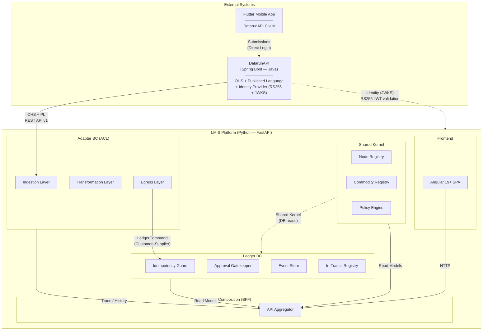

# Context Map — Datarun Health LMIS

## Overview

This document defines the **DDD Strategic Relationships** between all Bounded Contexts in the system and external systems. It is the authoritative reference for who owns what contract and which direction dependencies flow.

---

## Context Diagram

---

## Relationship Registry

| From | To | DDD Pattern | Contract Owner | Notes |
|---|---|---|---|---|
| **DatarunAPI** | **Adapter** | **Open-Host Service + Published Language** (upstream) / **ACL** (downstream) | DatarunAPI owns the API schema. Adapter owns translation via mapping contracts. | DatarunAPI is our own platform but is treated as an independent upstream. |
| **Adapter** | **Ledger** | **Customer–Supplier** | Ledger owns `LedgerCommand` schema (Published Language). Adapter conforms. | Synchronous HTTP POST. Ledger has no knowledge of the Adapter. |
| **Kernel** | **Ledger** | **Shared Kernel** | Co-owned within the Python monolith. | Ledger reads Kernel registries (nodes, commodities, policies) via direct DB access. |
| **Kernel** | **Future BCs** | **Shared Kernel** | Co-owned. | Same pattern extends to CaseMgmt, Inventory Analytics, etc. |
| **BFF** | **All BCs** | **Composition** (read-only) | BFF conforms to each BC's read models. | BFF never writes to any BC. Queries Adapter + Ledger + Kernel. |
| **Frontend** | **BFF** | **Presentation** | BFF defines the aggregated API. | SPA never calls domain BCs directly. |
| **DatarunAPI** | **All LMIS services** | **Identity Provider** | DatarunAPI owns user identity. LMIS owns authorization. | SSO via JWKS. No LMIS vocabulary in JWT. |

---

## External Systems

| System | Owner | Relationship to LMIS | Integration Point |
|---|---|---|---|
| **DatarunAPI** | Us (separate codebase, Java/Spring Boot) | OHS + Published Language | Adapter ingestion endpoint. See [Integration Contract](integration-contract-datarunapi.md). |
| **Flutter Mobile App** | Us (Dart) | DatarunAPI client | No direct relationship to LMIS. Submits to DatarunAPI only. |

---

## Boundary Rules

1. **No BC imports another BC's Python classes.** Enforced by modular monolith structure.
2. **DatarunAPI never contains LMIS vocabulary** (stock, commodity, ledger). It stays generic.
3. **The Ledger never knows who called it.** It processes `LedgerCommand`s. Period.
4. **The BFF never writes** to any domain BC. Read-only aggregation.
5. **Adding a new downstream BC** (e.g., CaseMgmt) requires only:
   - A new Adapter mapping contract (or new Adapter variant)
   - New entry in this Context Map
   - New BFF aggregation routes
   - No changes to existing BCs.
6. **Identity = DatarunAPI, Authorization = LMIS.** DatarunAPI's JWT contains only generic claims (`sub`, `name`). LMIS-specific roles and node access live in `lmis_user_permissions`.
7. **Each BC can have its own UI.** DatarunAPI admin, LMIS SPA, future BC frontends are separate apps sharing SSO via JWKS.

## Related Docs

- [System Overview](system-overview.md)
- [Integration Contract — DatarunAPI](integration-contract-datarunapi.md)
- [Auth & Authorization](auth-and-authorization.md)
- [ADR-008: Auth Phased Strategy](../adrs/008-auth-phased-strategy.md)
