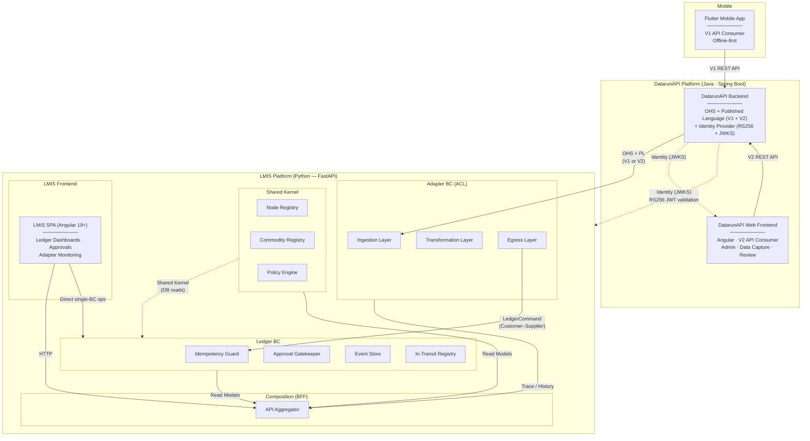

# Context Map — Datarun Health LMIS

## Overview

This document defines the **DDD Strategic Relationships** between all Bounded Contexts in the system and external systems. It is the authoritative reference for who owns what contract and which direction dependencies flow.

---

## Context Diagram

---

## Relationship Registry

| From | To | DDD Pattern | Contract Owner | Notes |
|---|---|---|---|---|
| **DatarunAPI** | **Adapter** | **Open-Host Service + Published Language** (upstream) / **ACL** (downstream) | DatarunAPI owns the API schema (V1 + V2). Adapter owns translation via mapping contracts. | DatarunAPI is our own platform but is treated as an independent upstream. Adapter may consume V1 or V2. |
| **DatarunAPI Web Frontend** | **DatarunAPI Backend** | **Presentation** | DatarunAPI Backend owns the V2 API. Frontend conforms. | V2 REST only. No relationship to LMIS. |
| **Adapter** | **Ledger** | **Customer–Supplier** | Ledger owns `LedgerCommand` schema (Published Language). Adapter conforms. | Synchronous HTTP POST. Ledger has no knowledge of the Adapter. |
| **Kernel** | **Ledger** | **Shared Kernel** | Co-owned within the Python monolith. | Ledger reads Kernel registries (nodes, commodities, policies) via direct DB access. |
| **Kernel** | **Future BCs** | **Shared Kernel** | Co-owned. | Same pattern extends to CaseMgmt, Inventory Analytics, etc. |
| **BFF** | **All BCs** | **Composition** (read-only) | BFF conforms to each BC's read models. | Aggregates multi-BC reads only. Never writes. Never proxies single-BC operations. |
| **LMIS SPA** | **BFF + Domain BCs** | **Presentation** | Each BC defines its own HTTP API. BFF defines composed views. | SPA calls BFF for multi-BC reads; calls domain BC endpoints directly for single-BC reads and writes. |
| **DatarunAPI** | **All LMIS services** | **Identity Provider** | DatarunAPI owns user identity. LMIS owns authorization. | SSO via JWKS. No LMIS vocabulary in JWT. |

---

## External Systems

| System | Owner | Relationship to LMIS | Integration Point |
|---|---|---|---|
| **DatarunAPI** | Us (separate codebase, Java/Spring Boot) | OHS + Published Language (V1 + V2) | Adapter ingestion endpoint. See [Integration Contract](integration-contract-datarunapi.md). |
| **DatarunAPI Web Frontend** | Us (Angular, separate codebase) | No relationship to LMIS | Consumes DatarunAPI V2 REST API only. Shares SSO via JWKS. |
| **Flutter Mobile App** | Us (Dart) | DatarunAPI V1 client | No direct relationship to LMIS. Submits to DatarunAPI only. |

---

## Boundary Rules

1. **No BC imports another BC's Python classes.** Enforced by modular monolith structure.
2. **DatarunAPI never contains LMIS vocabulary** (stock, commodity, ledger). It stays generic.
3. **The Ledger never knows who called it.** It processes `LedgerCommand`s. Period.
4. **The BFF is for composed reads only.** It aggregates multi-BC queries. Single-BC reads and all writes go directly to the domain BC's own HTTP endpoint. The BFF never proxies writes.
5. **The LMIS SPA never imports BC Python code.** Isolation is at the code-import level, not the HTTP-routing level. Every BC exposes its own HTTP API; the SPA calls them directly for single-BC operations.
6. **Adding a new downstream BC** (e.g., CaseMgmt) requires only:
   - A new Adapter mapping contract (or new Adapter variant)
   - New entry in this Context Map
   - New BFF aggregation routes
   - No changes to existing BCs.
7. **Identity = DatarunAPI, Authorization = LMIS.** DatarunAPI's JWT contains only generic claims (`sub`, `name`). LMIS-specific roles and node access live in `lmis_user_permissions`.
8. **DatarunAPI Web Frontend and LMIS SPA are separate apps.** Different codebases, different repositories, different APIs. They share SSO via DatarunAPI's JWKS endpoint. They have no code-level dependency on each other. See [DatarunAPI Frontend Architecture](../frontend/datarunapi-frontend/overview.md).
9. **DatarunAPI's V1 and V2 APIs coexist.** Both serve the same canonical store. V1 remains for mobile. V2 is for the web frontend and future consumers. Downstream BCs migrate to V2 at their own pace. See [Integration Contract](integration-contract-datarunapi.md).

## Related Docs

- [System Overview](system-overview.md)
- [Integration Contract — DatarunAPI](integration-contract-datarunapi.md)
- [Auth & Authorization](auth-and-authorization.md)
- [ADR-008: Auth Phased Strategy](../adrs/008-auth-phased-strategy.md)
